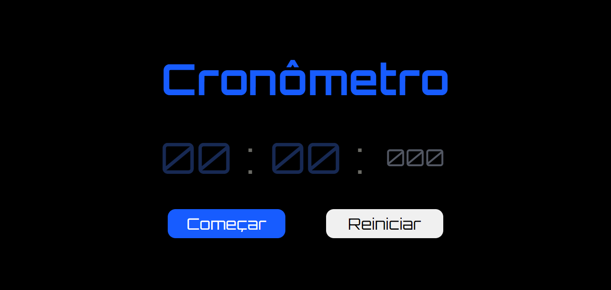

<h1>Cronômetro em JavaScript</h1>

Mais um projeto
Com o apoio dos sócios do DevClub, concluí o desenvolvimento de um cronômetro funcional e interativo usando JavaScript.

>Cronômetro: https://daliosy.github.io/cronometro/

<h2>Habilidades recentes:</h2>

Aprendi setTimeout, setInterval, clearInterval no JavaScript.

<h2>Contato:</h2>

> Linkedin: https://www.linkedin.com/in/dalio-s-yamada/

> Github: https://github.com/DalioSY/cronometro

#HTML #CSS #JavaScript #Programação  #Dev #Desenvolvedor-Web #DesenvolvedorFrontEnd #DesenvolvedorFullStack #TransiçãoDeCarreira #Oportunidades #DisponívelParaTrabalho

